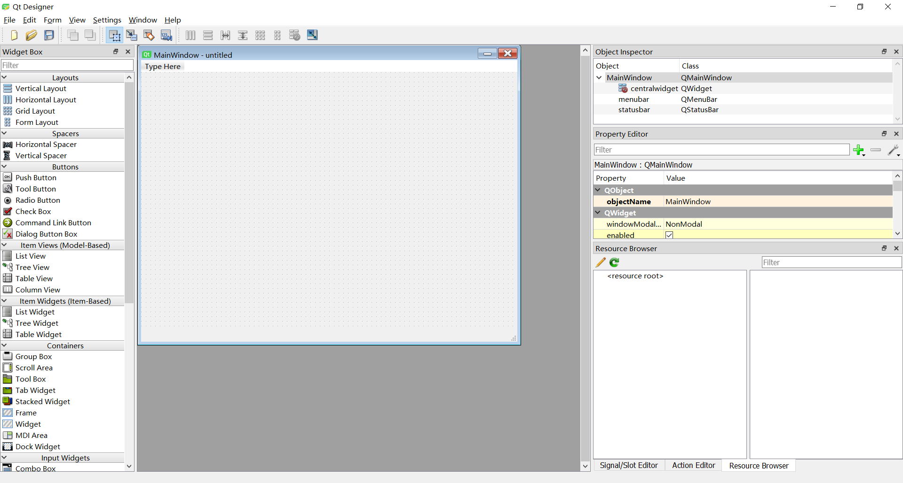
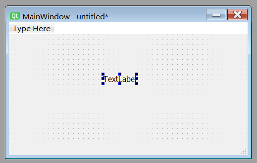
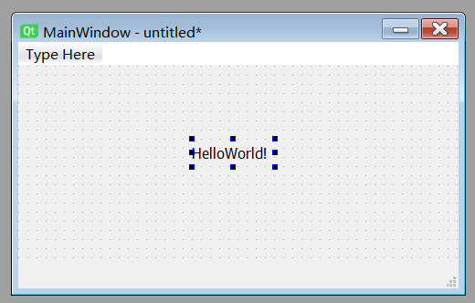
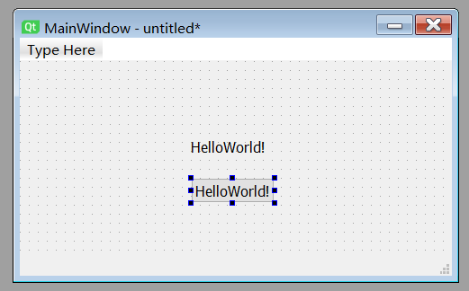
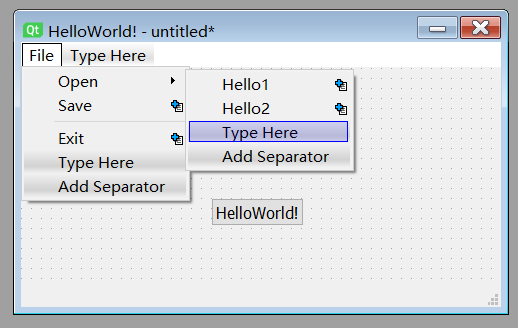
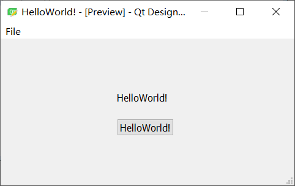
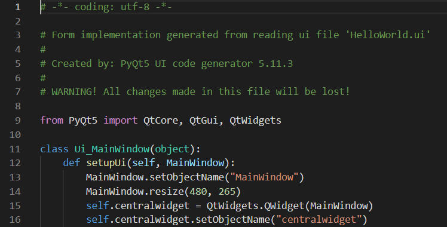
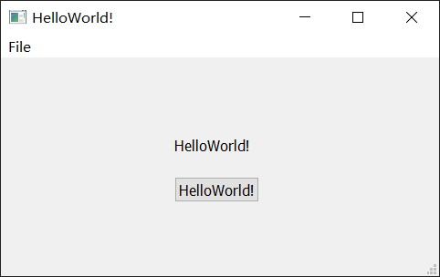
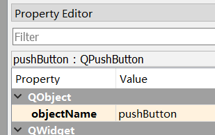

# PyQt5入门教程

在网上看了不少关于PyQt5的中文教程，但是无外乎是过时了，讲解不清晰易懂，或者资料不完整。Youtube上面倒是有不少视频，但是不少Youtuber居然还在手写ui而不是利用方便快捷的Qt Designer。仅有的几个视频虽然利用了Qt Designer来设计UI，但是他们并没有将UI跟逻辑分离，这种行为并不是我期望的。

为此，我花费了不少时间在网上寻找各种资料。于是乎，我最终还是下定决心把自己的学习过程给记录下来。记录下来是给我自己复习跟参考的，如果有人能够从中受益，那也挺好，不用浪费时间去到处找答案。

## 0x00 安装环境清单
我使用的环境如下：

* Windows 10 (Build 17763)
* Python 3.7.2
* VSCode 1.33.0
* PyQt5
* Qt Designer

如果你使用的是OSX或者Linux，请自行替换教程中的一些操作。

本文并不讨论Python和VSCode的安装，如果没有VSCode，你可以用各种同类IDE替代或者安装它。

本文不讨论多Python共存，毕竟Python2.7在2020年就要退役了，而且我本人也没这需求。

## 0x01 安装PyQt5

下面直接使用pip来安装PyQt5，此处可能是pip/pip3，或者两者皆可，后面不再重复

直接pip安装PyQt5

```
pip install PyQt5
```

由于Qt Designer已经在Python3.5版本从PyQt5转移到了tools，因此我们还需要安装pyqt5-tools

```
pip install pyqt5-tools
```

到这一步，PyQt5就安装完成了，你可以通过下面若干可选的操作来检查是否已经安装成功：

* Win+S呼出Cornata主面板（搜索框），输入designer，如果看到跟下图类似的结果说明PyQt Designer已经被安装


* 在cmd中输入pyuic5，如果返回“Error: one input ui-file must be specified”说明安装成功。

## 0x02 初识Qt Designer

注：Qt Designer的界面是全英文的，幸运的是有汉化方法，不过因为我本人用不上，所以如果有这方面需求可以自行搜索。

我比较习惯用Win+S呼出Cornata主面板（搜索框）来启动各种应用，那么这里就是在搜索框中输入designer并敲回车，就能够启动Qt Designer了。

初次启动会弹出这个“New Form”窗口，一般来说选择“Main Window”然后点击“Create”就可以了。下方有个“Show this Dialogue on Startup”的checkbox，如果不想每次启动都看到这个“New Form”窗口，可以取消勾选。


创建“Main Window”之后，我们会看到如下画面



下面就来简单介绍下整个画面的构成：

* 左侧的“Widget Box”就是各种可以自由拖动的组件

* 中间的“MainWindow - untitled”窗体就是画布

* 右上方的"Object Inspector"可以查看当前ui的结构

* 右侧中部的"Property Editor"可以设置当前选中组件的属性

* 右下方的"Resource Browser"可以添加各种素材，比如图片，背景等等，目前可以不管

大致了解了每个板块之后，就可以正式开始编写第一个UI了

## 0x03 HelloWorld!

通常来说，编写GUI有两种方法：第一种就是直接使用方便快捷的Qt Designer，第二种就是写代码。在有Qt Designer的情况下，是完全不推荐费时费力去手写GUI代码的。Qt Designer可以所见即所得，并且可以方便的修改并做出各种调整。

按照惯例，我们先来实现一个能够显示HelloWorld的窗口。


1）添加文本

在左侧的“Widget Box”栏目中找到“Display Widgets”分类，将“Label”拖拽到屏幕中间的“MainWindow”画布上，你就获得了一个仅用于显示文字的文本框，如下图所示。



2）编辑文本

双击上图中的“TextLabel”，就可以对文本进行编辑，这里我们将其改成“HelloWorld!”，如下图所示。如果文字没有完全展示出来，可以自行拖拽空间改变尺寸。

**特别提醒，编辑完文本之后记得敲击回车令其生效！**



3）添加按钮

使用同样的方法添加一个按钮（PushButton）并将其显示的文本改成“HelloWorld!”，如下图所示。



4）修改窗口标题

下面修改窗口标题。选中右上方的"Object Inspector"中的“MainWindow”，然后在右侧中部的"Property Editor"中找到“windowTitle”这个属性，在Value这一栏进行修改，修改完记得敲击回车。

5）编辑菜单栏

注意到画布的左上方有个“Type Here”，双击它即可开始编辑菜单栏。菜单栏支持创建多级菜单以及分割线（seperator）。我随意创建了一些菜单项目，如下图所示。



6）预览

使用快捷键Ctrl+R预览当前编写的GUI（或者从菜单栏的Form > Preview / Preview in进入）



7）保存

如果觉得完成了，那就可以保存成*.ui的文件，这里我们保存为HelloWorld.ui。为了方便演示，我将文件保存到D盘。

8）生成Python代码

使用cmd将目录切到D盘并执行下面的命令。请自行将下面命令中的name替换成文件名，比如本例中的“HelloWorld.ui”

```
pyuic5 -o name.py name.ui
```

生成的代码应该类似下图所示



9）运行Python代码

此时尝试运行刚刚生成的“HelloWorld.py”是没用的，因为生成的文件并没有程序入口。因此我们在同一个目录下另外创建一个程序叫做“main.py”，并输入如下内容。在本例中，gui_file_name就是HelloWorld，请自行替换。

```Python
import sys
from PyQt5.QtWidgets import QApplication, QMainWindow

import gui_file_name

if __name__ == '__main__':
    app = QApplication(sys.argv)
    MainWindow = QMainWindow()
    ui = gui_file_name.Ui_MainWindow()
    ui.setupUi(MainWindow)
    MainWindow.show()
    sys.exit(app.exec_())
```

然后运行“main.py”，你就能看到刚刚编写的GUI了！



10）组件自适应

如果你刚刚尝试去缩放窗口，会发现组件并不会自适应缩放，因此我们需要回到Qt Designer中进行一些额外的设置。

点击画布空白处，然后在上方工具栏找到grid layout或者form layout，在本例中我们使用grid layout。两种layout的图标如下图所示。


设置grid layout后，我们使用Ctrl+R预览，这次组件可以自适应了！因为我们已经将UI（HelloWorld.py/HelloWorld.ui）跟逻辑（main.py）分离，因此直接重复步骤7-8即可完成UI的更新，无需改动逻辑（main.py）部分。

## 0x04 人机交互

刚刚写的HelloWorld中，我们设置的按钮（PushButton）是没有实际作用的，因为我们并没有告诉这个按钮应该做什么。实际上，要让这个按钮做点什么只需要增加一行代码就可以了。

1）获取按钮id

打开HelloWorld.ui，在designer中选中对应的按钮，从“Property Editor”中可以得知这个按钮的“objectName”叫做“pushButton”，如下图所示。



2）设置触发

Qt中有“信号和槽(signal and slot)”这个概念，不过目前无需深究，也无需在Designer中去设置对应按钮的“信号和槽”，直接在“main.py”中“MainWindow.show()”的后面加入下面这样的一行代码

```Python
ui.pushButton.clicked.connect(click_success)
```

下面简单解释下这行代码

* pushButton就是刚刚获取的按钮id
* clicked就是信号，因为是点击，所以我们这里用clicked
* click_success就是对应要调用的槽，注意这里函数并不写成click_success()

3）设置函数

既然刚刚设置了按钮的触发并绑定了一个函数click_success，我们就要在“main.py”中实现它。示例如下

```Python
def click_success():
    print("啊哈哈哈我终于成功了！")
```

4）运行！

UI跟逻辑分离的好处就在这里，我们这次不用去管“HelloWorld.py”了，直接运行修改完的“main.py”。点击按钮，这次你会发现在控制台中有了我们预设的输出。

最后附上此时main.py的代码

```Python
import sys
from PyQt5.QtWidgets import QApplication, QMainWindow

import HelloWorld

def click_success():
    print("啊哈哈哈我终于成功了！")

if __name__ == '__main__':
    app = QApplication(sys.argv)
    MainWindow = QMainWindow()
    ui = HelloWorld.Ui_MainWindow()
    ui.setupUi(MainWindow)
    MainWindow.show()
    ui.pushButton.clicked.connect(click_success)
    sys.exit(app.exec_())
```

## 0x05 小结

本文只是抛砖引玉，上面这些只是PyQt5的入门内容。不过学会了按钮的交互方法，其它的也差不多能依葫芦画瓢做出来。

本文中设计的程序在/assets/code/pyqt5中。

那么，就先写到这里了！